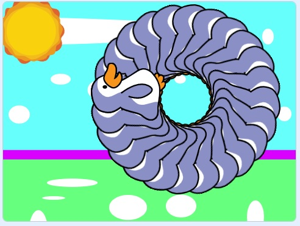
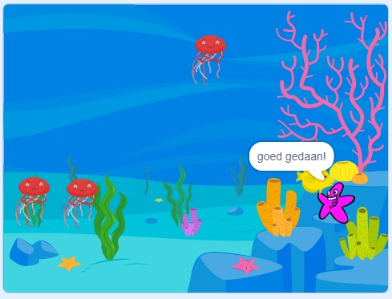
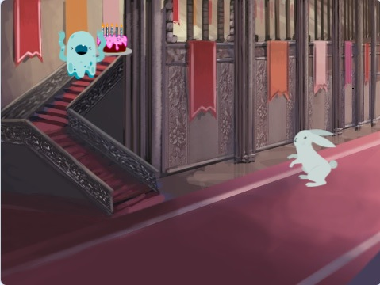

# :mortar_board: Scratch Projecten

:heavy_check_mark: Completed  
:o: Incomplete

## :beginner: Everything Kids’ Scratch Coding Book

1. :heavy_check_mark: THE BASICS OF SCRATCH
2. :heavy_check_mark: MOTION
3. :heavy_check_mark: LOOKS AND ANIMATION
4. :heavy_check_mark: SOUNDS

### Projecten

- `PenguinDraai.sb3`  

- `ZeeParkour.sb3`  

- `TaartFeestje.sb3`  

## :page_with_curl: License

The source code is free -- see the [LICENSE](LICENSE) file for details
